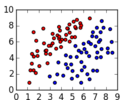
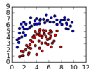

Binary classification dataset
=============================

This repository contains some binary classification data and **a script to
mannually create 2D datasets**.

Data
----

|data name  |size        |thumbnail                              |comments
|-----------|------------|---------------------------------------|--------
|data0      |100         |            |linear separable
|data1      |100         |            |

Formats
-------

Without explicit statements, 

* data points are labeled as `1` and `-1`
* within range `[0 10 0 10]`
* format for each row in the csv files: `label x y`

Useful tools
------------

Located in `bin/`:

* `gen2dPoints.py`: generate 2D points dataset manually

